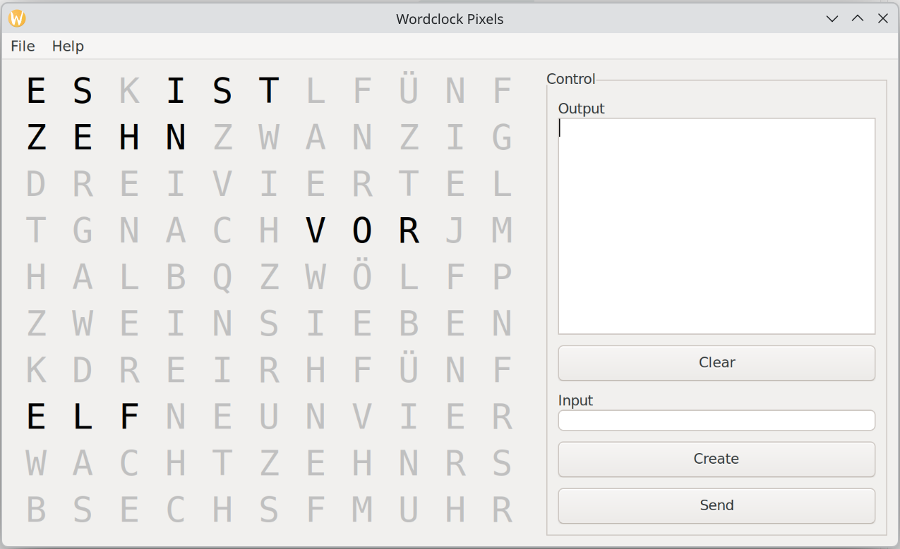

# Wordclock — a German word clock (Wortuhr)

A word clock that spells the time out in German words: an 11×10 grid of letters
on WS2812 LEDs, driven by one firmware that runs on an ESP32-S3, a Raspberry Pi
Pico 2 W (RP2350), an AVR128DA48 — and on a PC, where a simulator draws the
matrix in a window so the clock can be built and debugged without hardware.

The window above shows 16:20, which German says as *zehn vor halb fünf* — ten
before half five, the kind of wording the word tables have to cover.

## Reference

- [Serial command reference](serial-commands.md) — every command the clock
  answers, over the serial port and over the web console alike.
- [Fonts](fonts.md) — the bitmap font table format, and how to regenerate one.
- [Roadmap](roadmap.md) — what is planned, why, and what each item touches.

## Auf Deutsch

Eine Wortuhr, die die Zeit in deutschen Worten anzeigt: 11×10 Buchstaben,
WS2812-LEDs, Konfiguration per Handy über WLAN, Zeit über NTP, automatische
Helligkeit und Update over the air. Die Firmware läuft auf ESP32-S3, Raspberry
Pi Pico 2 W und AVR128DA48 — und im Simulator auf dem PC, ganz ohne Hardware.

## The code

The firmware, the three hardware backends, the simulator and the build
instructions are on GitHub: [AndreasBur/Wordclock](https://github.com/AndreasBur/Wordclock).
